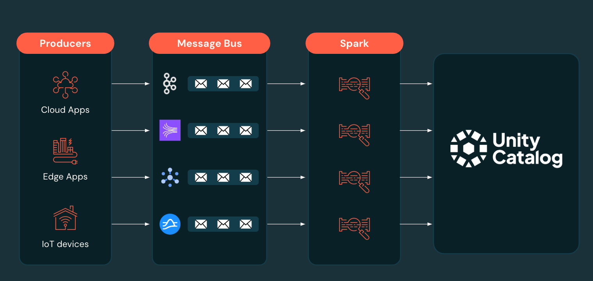
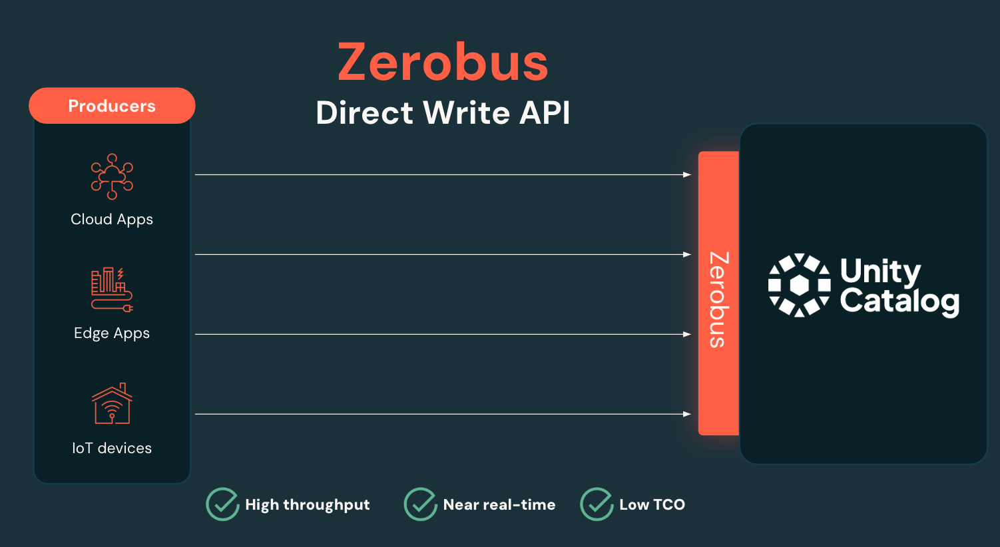

# Zerobus

## Overview
Zerobus is a high-throughput direct write API that's part of Lakeflow Connect, designed to eliminate message bus hops in streaming architectures. It enables data producers—from IoT devices and edge applications to cloud services—to write data directly to the Databricks lakehouse with minimal latency and maximum throughput.

By removing the traditional message bus intermediary (like Kafka or Kinesis), Zerobus simplifies streaming architectures, reduces data duplication, and accelerates time-to-insights for real-time data scenarios such as IoT telemetry, clickstreams, and operational metrics.

## Resources
### Blogs & Docs
- **GA Announcement**: [Announcing the General Availability of Databricks Lakeflow](https://www.databricks.com/blog/announcing-general-availability-databricks-lakeflow)
- **Official Documentation**: [Lakeflow Connect](https://docs.databricks.com/aws/en/ingestion/overview)

### Sessions & Videos
| | |
|---|---|
|  | **Eliminate Hops in Your Streaming Architecture with Zerobus** [Data + AI Summit Session Details](https://www.databricks.com/dataaisummit/session/eliminate-hops-your-streaming-architecture-zerobus-part-lakeflow) Learn how Zerobus eliminates message bus complexity and enables direct streaming to the lakehouse. |
|  | **Keynote: Announcing Lakeflow** The main keynote announcement covers all of Lakeflow, including Zerobus as part of Lakeflow Connect. |

## Key Features
### Direct Write Architecture
- **Eliminates Message Bus Hops**: Write directly to Delta tables without intermediate message bus infrastructure
- **High Throughput**: Support for up to 100 MB/s per connection with thousands of concurrent connections
- **Low Latency**: 5-second latency for real-time streaming scenarios
- **Built on Open Formats**: Leverages Delta Lake, Parquet, and Iceberg for maximum compatibility

### Simplified Streaming
- **Reduced Complexity**: No need to manage Kafka, Kinesis, or other message bus infrastructure
- **Lower Operational Overhead**: Eliminates data duplication and reduces monitoring complexity
- **Unified Governance**: All data immediately available in Unity Catalog with full lineage tracking

### Developer-Friendly
- **Multiple SDKs**: Python, Scala, and Java SDKs available
- **Cloud Agnostic**: Support for Azure and AWS (GCP coming soon)
- **Production Ready**: Includes exactly-once delivery, schema evolution, and batch APIs (planned)

## Why It Matters
Traditional streaming architectures require multiple hops through message buses, creating complexity, data duplication, and operational overhead. Zerobus solves this by:

- **Accelerating Time to Insights**: Direct writes eliminate processing delays from intermediate systems
- **Reducing Infrastructure Costs**: No need to provision and maintain separate message bus infrastructure
- **Simplifying Data Flows**: Streamlined architecture makes it easier to build and maintain real-time applications
- **Enabling Real-Time Analytics**: Direct lakehouse writes enable immediate analytics and AI processing

## Use Cases
- **IoT and Edge Computing**: Direct telemetry ingestion from manufacturing equipment, sensors, and edge devices
- **Clickstream Analytics**: Real-time user behavior tracking and analysis
- **Operational Metrics**: Application performance monitoring and business metrics
- **Real-Time Dashboards**: Live data visualization and alerting systems

## Customer Success
- **Joby Aviation**: Uses Zerobus to streamline data ingestion from manufacturing and IoT devices, accelerating time to insights
- **Soracom**: Leverages direct write capabilities for simplified IoT data flows

## Decision Framework
Zerobus is ideal when:
- **Ingestion is the primary use case**: You need to get data into the lakehouse quickly and reliably
- **Real-time operational consumers aren't required**: The focus is on analytics and AI processing rather than real-time operational systems
- **Simplified architecture is desired**: You want to reduce infrastructure complexity and operational overhead

## Related Features
- [Lakeflow Connect](../managed-connectors/)
- [Declarative Pipelines](../declarative-pipelines/)
- [Unity Catalog](../../unity-catalog/)
- [Databricks SQL](../../databricks-sql/)
